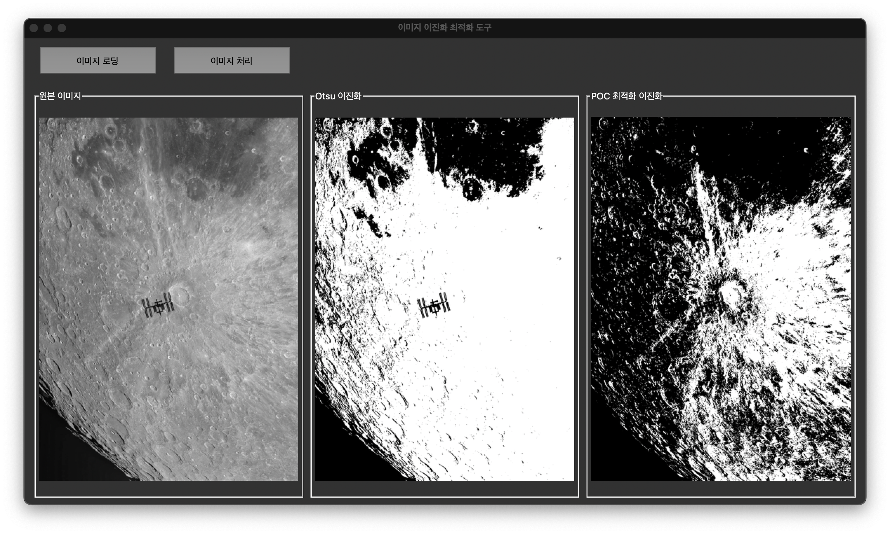
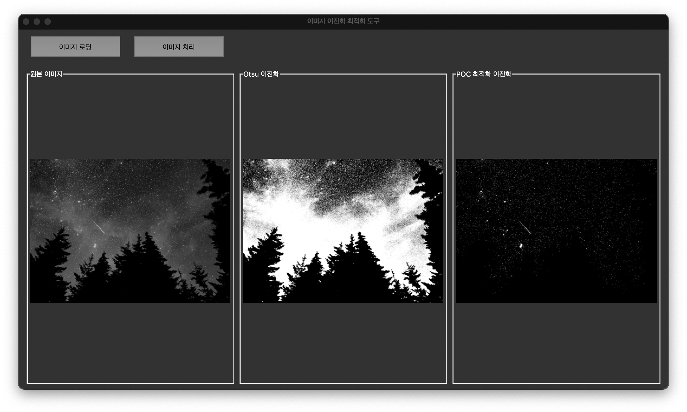
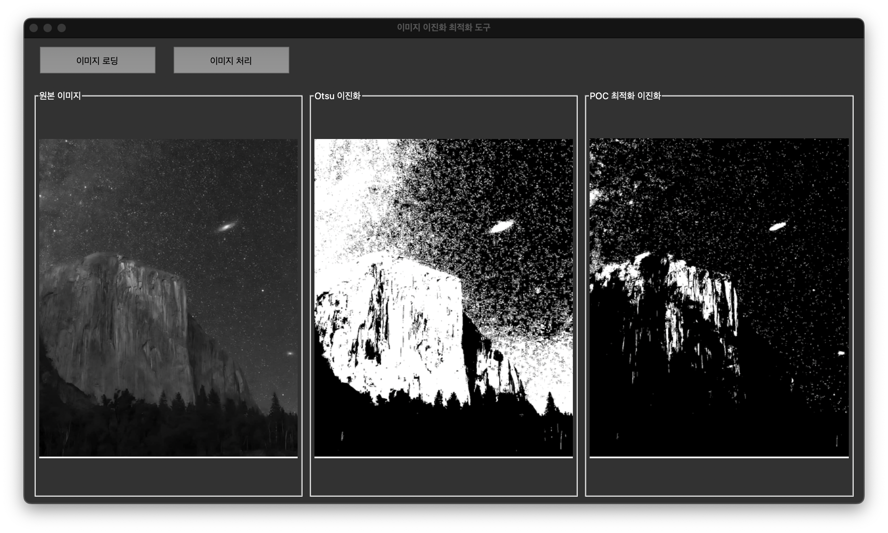

# POC 기반 최적 이진화 (POC-based Optimal Thresholding)

이 프로젝트는 Phase Only Correlation(POC) 기법을 활용하여 이미지 이진화를 위한 최적의 임계값을 찾는 알고리즘을 구현한 애플리케이션입니다.

## 실행 결과 예시

### 예시 1: 복잡한 이미지 이진화


### 예시 2: 문서 이미지 이진화


### 예시 3: 저대비 이미지 이진화


## 개요

이미지 이진화(Binary Thresholding)는 그레이스케일 이미지를 흑백 이미지로 변환하는 과정으로, 컴퓨터 비전과 이미지 처리 분야에서 중요한 전처리 단계입니다. 일반적으로 사용되는 Otsu 방법은 이미지의 히스토그램을 기반으로 임계값을 선택하지만, 복잡한 이미지에서는 최적의 결과를 제공하지 못할 수 있습니다.

이 애플리케이션은 이미지의 주파수 도메인 정보를 활용하는 Phase Only Correlation 기법을 적용하여 최적의 이진화 임계값을 찾아내는 방법을 구현했습니다.

## 작동 원리

1. **위상 정보(Phase Information) 활용**:
   - 이미지를 DFT(Discrete Fourier Transform)를 통해 주파수 도메인으로 변환
   - 원본 이미지의 위상 정보를 추출
   - 다양한 임계값으로 이진화된 이미지의 위상 정보와 원본 이미지의 위상 정보 간의 상관관계 측정

2. **최적 임계값 결정**:
   - 위상 상관관계(Phase Correlation)가 최대가 되는 임계값 선택
   - 이 임계값을 사용하여 최종 이진화 수행

3. **Otsu 방법과 비교**:
   - 기존의 Otsu 방법과 POC 기반 방법의 결과를 시각적으로 비교

## 애플리케이션 기능

- 그레이스케일 이미지 로드
- Otsu 방법을 사용한 이미지 이진화
- POC 기반 최적 임계값을 사용한 이미지 이진화
- 원본, Otsu, POC 결과 이미지 시각화
- 각 방법의 임계값 정보 표시

## 필요 라이브러리

- NumPy
- OpenCV (cv2)
- Tkinter
- PIL (Pillow)
- Matplotlib

## 설치 및 실행

```bash
# 필요 라이브러리 설치
pip install numpy opencv-python pillow matplotlib

# 실행
python poc_thresholding.py
```

## 사용 방법

1. "이미지 로딩" 버튼을 클릭하여 처리할 이미지 선택
2. 이미지가 로드되면 자동으로 처리 진행
3. 원본, Otsu 이진화, POC 최적화 이진화 결과를 비교

## 응용 분야

- 문서 이미지 이진화
- 의료 영상 분할
- 산업용 검사 시스템
- 패턴 인식
- OCR(Optical Character Recognition) 전처리

## 참고 자료

- Phase Only Correlation (POC) 기법은 이미지 정합(Image Registration)과 패턴 인식 분야에서 널리 사용됩니다.
- 위상 정보는 이미지의 구조적 특성을 잘 보존하므로, 이진화 과정에서 중요한 특징을 유지하는 데 도움이 됩니다.

## 라이센스

MIT

## 제작자

[bemoregt](https://github.com/bemoregt)